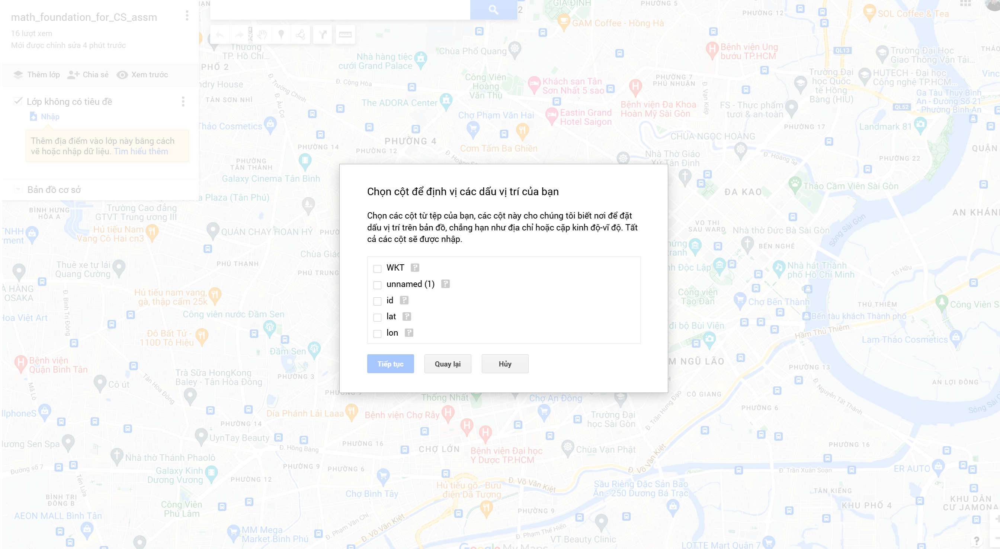
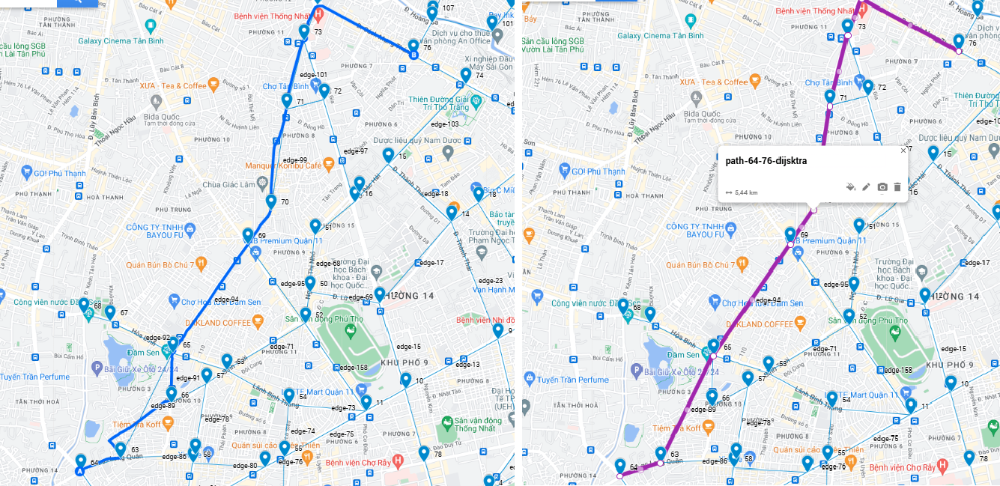

# SHORTEST PATH ALGORITHMS IMPLEMENT

This guide will help you run a local Python script on your machine. Follow the steps below to ensure you have everything set up correctly.

## Prerequisites

1. **Python Installation**
   - Ensure that Python is installed on your machine. You can download the latest version of Python from the [official Python website](https://www.python.org/downloads/).
   - After installation, verify the installation by running the following command in your terminal or command prompt:
     ```bash
     python --version
     ```
     or for some installations:
     ```bash
     python3 --version
     ```

2. **Pip Installation**
   - Pip is the package installer for Python. It should be installed automatically with Python. Verify pip installation by running:
     ```bash
     pip --version
     ```
     or for some installations:
     ```bash
     pip3 --version
     ```

3. **Packages Installation**
    - Run:
        ```
        pip install -r requirements.txt
        ```
        or
        ```
        pip3 install -r requirments.txt
        ```

## Running The Algorithm

- Command:
    ```
    python main.py <start_index> <end_index>
    ```
- Output:
    - length of the shortest paths of three algorithms
    - the shortest paths of three algorithms
    - file named **solutions/path-<start_index>-<end_index>.csv**
## Included files
- Data:

    - nodes.csv: spreadsheet contains data about nodes
    - edges.csv: spreadsheet contains data about edges
    - base.csv: spreadsheet contains merged data (nodes and edges), location presented by WKT format
- Solutions:
    - path-\*-\*.csv: example solution, contains path data
## Visualizations

Follow these steps to visualize path:


1.  Create a copy of Ho Chi Minh city map ([Google My Map](https://www.google.com/maps/d/u/0/))
    
    
2. Upload *base.csv* to a layer, then choose WKT and id sequencely for location and identification information.
    
    After this step, the map would look like the following image:
    

3. Run the algorithm and get the output files named **path-<start_index>-<end_index>.csv** inside *solutions* folder. Upload path file just like uploading *base.csv*, receiving the visualization of path found by algorithms
    

4. [Optional] Compare with google's solution:
    Use navigation feature in tool bar, choose *driving car* option with start and end point.
    
    Compare image
    
